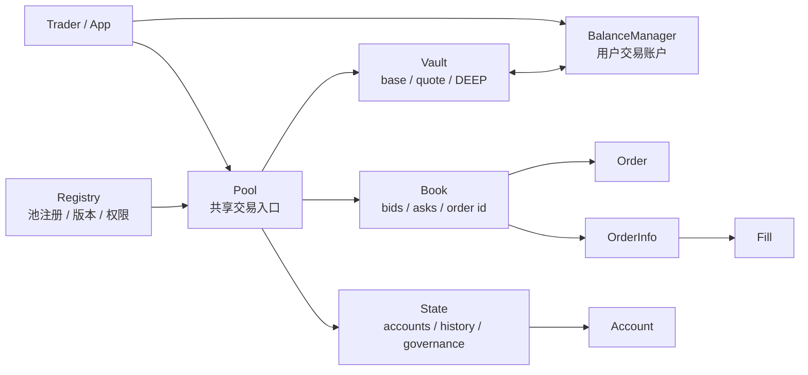

# ch03-01 全景图：Pool、Book、State、Vault、BalanceManager、Registry

[返回本章](README.md)

## 先抓住结构

读“全景图：Pool、Book、State、Vault、BalanceManager、Registry”时先画边界。一个真实协议最容易读乱的地方，不是函数太多，而是不知道 Pool、Book、State、Vault 和 BalanceManager 各自负责哪一段。

## 架构坐标

先把架构坐标钉在这些文件上。读这一节时不需要展开所有实现，只要看清对象分工、入口函数和后续会反复回来的状态边界。

- [packages/deepbook/sources/pool.move](https://github.com/MystenLabs/deepbookv3/blob/663edbf9c30d6c93100e6cd66936e1487a5dc9e0/packages/deepbook/sources/pool.move)
- [packages/deepbook/sources/book/book.move](https://github.com/MystenLabs/deepbookv3/blob/663edbf9c30d6c93100e6cd66936e1487a5dc9e0/packages/deepbook/sources/book/book.move)
- [packages/deepbook/sources/state/state.move](https://github.com/MystenLabs/deepbookv3/blob/663edbf9c30d6c93100e6cd66936e1487a5dc9e0/packages/deepbook/sources/state/state.move)
- [packages/deepbook/sources/vault/vault.move](https://github.com/MystenLabs/deepbookv3/blob/663edbf9c30d6c93100e6cd66936e1487a5dc9e0/packages/deepbook/sources/vault/vault.move)
- [packages/deepbook/sources/balance_manager.move](https://github.com/MystenLabs/deepbookv3/blob/663edbf9c30d6c93100e6cd66936e1487a5dc9e0/packages/deepbook/sources/balance_manager.move)
- [packages/deepbook/sources/registry.move](https://github.com/MystenLabs/deepbookv3/blob/663edbf9c30d6c93100e6cd66936e1487a5dc9e0/packages/deepbook/sources/registry.move)

这些入口是架构地图上的锚点。先标注每个模块负责的状态，再顺着一次下单或结算回到具体函数。

## 读架构

DeepBookV3 的核心不是一个单独的“订单簿对象”，而是以 `Pool<BaseAsset, QuoteAsset>` 为共享对象入口，把撮合、账户状态和资产保管组合到同一个池内版本化状态中。

`pool.move` 的 `Pool` 只有 `id: UID` 和 `inner: Versioned`。真正业务状态在 `PoolInner<BaseAsset, QuoteAsset>`：`allowed_versions`、`pool_id`、`book`、`state`、`vault`、`deep_price`、`registered_pool`。这意味着协议可以用 `Versioned` 控制包版本可用性，同时保留共享对象 ID 作为外部集成的稳定入口。

> **源码旁白**：看到 `Versioned` 时，不要把它当作普通包装字段略过。生产协议升级时，外部应用依赖稳定对象 ID，而内部状态需要版本门控；这正是 `Pool` 外壳很薄、`PoolInner` 承载业务状态的原因。

开发实践上，所有交易 PTB 都应把 `Pool` 当作唯一撮合入口，把 `BalanceManager` 当作用户资金账户。不要直接假设钱包 coin 就是交易余额；下单时 Pool 只和 `BalanceManager` 结算差额。

## 阅读补充

全景图的关键不是把模块名背下来，而是给每个模块放一个动词：`Pool` 接入口，`Book` 撮合，`State` 记账户/费用/历史，`Vault` 保管并结算资产，`BalanceManager` 表示用户交易账户，`Registry` 管版本和注册。

读源码时按一次下单横穿这些模块，而不是逐文件孤立阅读。只要能解释一个订单什么时候进入 Book、什么时候影响 State、什么时候由 Vault 改余额，就已经掌握了架构主线。

## 工程判断

- 架构图上同时标注对象职责和调用方向。
- 不要把 Book 画成资产保管方，资产最终在 Vault 和 BalanceManager 间结算。
- Registry 不是交易撮合模块，但版本和注册错误会阻断交易。

## 读完以后问自己

- 六个核心模块各自的一个动词职责是什么？
- 一次下单为什么会同时影响 Book、State 和 Vault？
- BalanceManager 为什么应画在用户侧和 Pool 之间？
