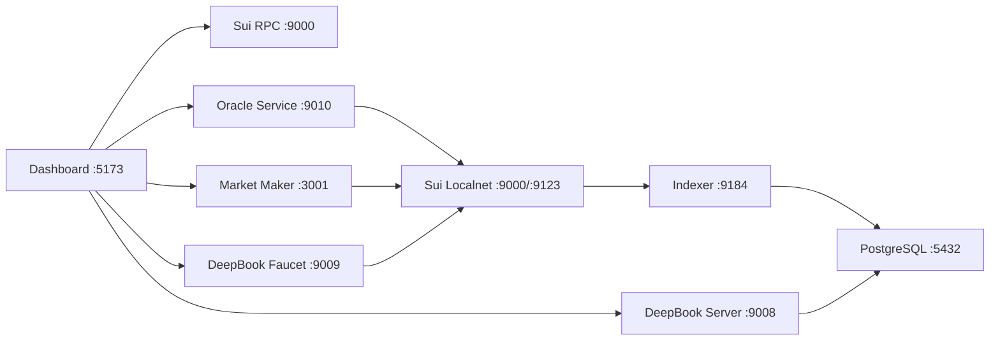

# ch16-03 服务拓扑和端口

[返回本章](README.md)

Sandbox 的服务很多，但拓扑并不混乱。先把它拆成三层：链上执行层、链下读模型层、开发体验层。链上执行层负责 localnet 和 Move package；链下读模型层负责 checkpoint、PostgreSQL、REST API；开发体验层负责 faucet、oracle、market maker 和 dashboard。

## 端口速查

| 服务 | 默认端口 | 主要用途 |
| --- | --- | --- |
| Dashboard | `5173` | 浏览器入口，查看健康状态、交易、faucet、部署地址。 |
| Sui RPC | `9000` | 本地链 RPC，SDK 和 Sui CLI 的主要入口。 |
| Sui Faucet | `9123` | Sui localnet 自带 faucet。 |
| DeepBook Faucet | `9009` | 发 SUI、DEEP、USDC，并暴露 deployment manifest。 |
| DeepBook Server | `9008` | 基于 indexer/PostgreSQL 的 DeepBook REST API。 |
| Oracle Service | `9010` | 查询 oracle 状态，服务会定期更新 price object。 |
| Market Maker | `3001` | 查询做市服务健康状态。 |
| Market Maker Metrics | `9091` | Prometheus metrics。 |
| Indexer | `9184` | 读取 checkpoint 并写入 PostgreSQL。 |
| PostgreSQL | `5432` | 保存 indexer 写入的读模型。 |

## 请求如何流动

Dashboard 并不直接“拥有”交易能力。它是一个代理和操作台：

- `/api/sui` 代理到本地 Sui RPC。
- `/api/oracle` 代理到 oracle service。
- `/api/mm` 代理到 market maker。
- `/api/faucet` 代理到 faucet service。
- `/api/deepbook` 代理到 DeepBook Server。

理解这一点后，排障会简单很多。Dashboard 的 Trading 页面失败，不代表 DeepBook 合约失败；可能是 faucet 没发币、wallet 没切 localnet、RPC 不通、Indexer 滞后、Server 查询不到，或者 PTB 构造本身 abort。

## Move 与数据层的边界

Move 合约只负责交易规则和资源安全。交易是否展示在页面上，取决于事件被 indexer 读到、写入 PostgreSQL，再被 server 查询出来。对用户而言这是一个页面状态；对工程师而言，这是至少三层系统之间的一致性问题。

所以本地调试要同时保留三类证据：

- 链上证据：transaction digest、object ID、event。
- 读模型证据：checkpoint、PostgreSQL 行、server response。
- UI 证据：dashboard 页面、浏览器请求、用户操作路径。

## 本节验收

- 能画出 localnet、indexer、server、dashboard 的依赖关系。
- 能根据端口判断哪个服务可能出错。
- 能解释为什么 UI 展示不是链上状态的唯一证据。
